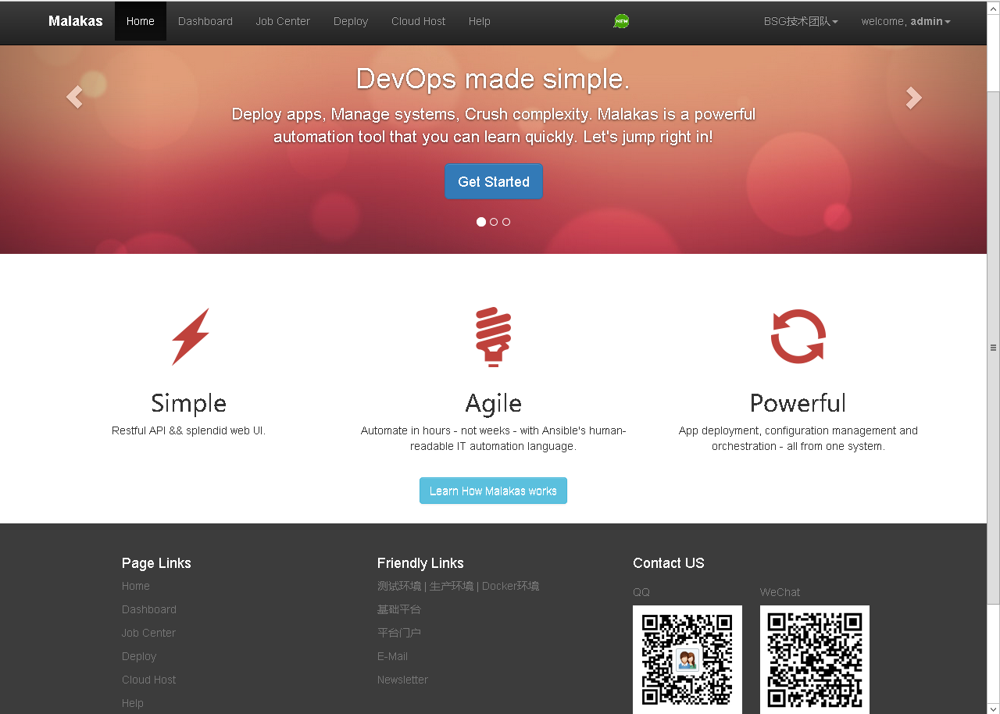
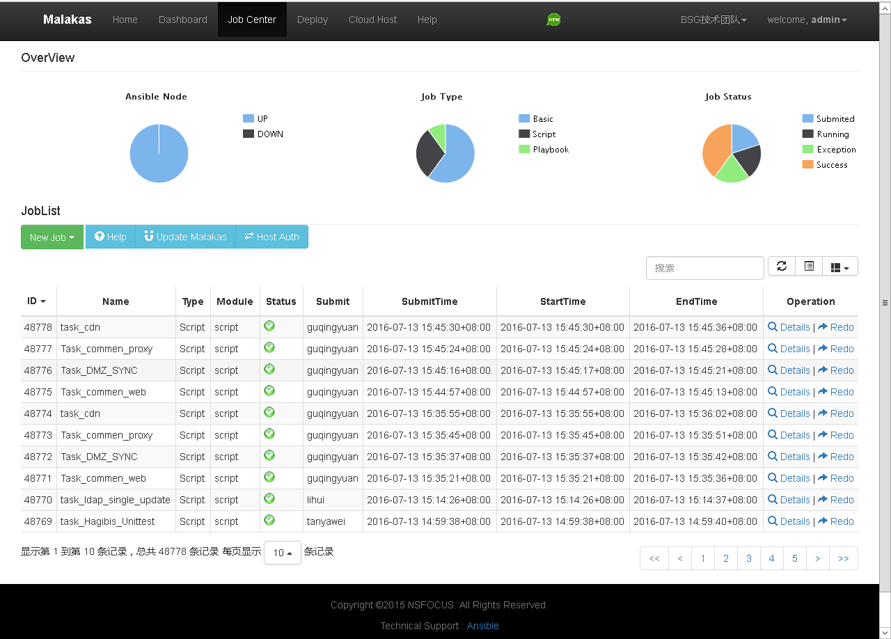
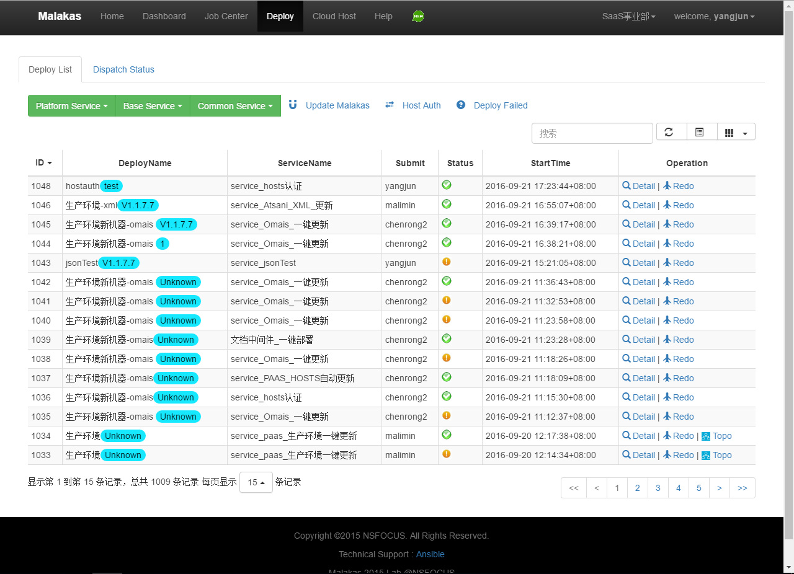
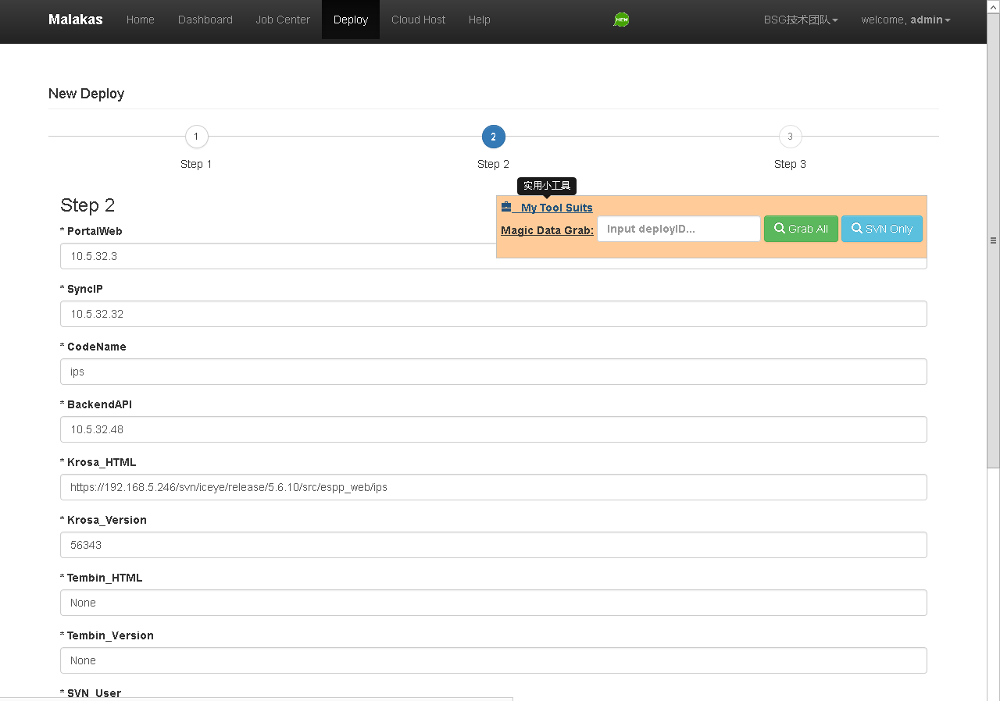

# easy-ansible
Automatical deployment platform based on ansible.

### 1.1、定位:    
easy-ansible为云环境下较大规模场景的业务自动化部署提供通用解决方案，并内置XX云自动化部署、更新、自验证等服务，助力敏捷开发、敏捷测试、敏捷运维！    

### 1.2、特性:    
easy-ansible妥善考虑基础能力完备、调度横向扩展、Restful API调用、自动部署服务化等因素。其特性如下：

    支持简单命令、Script脚本、基于Playbook复杂任务编排等各类简单自动化部署任务。
    支持基于自定义工作流的复杂任务调度，满足具有复杂拓扑依赖关系业务的自动化部署。
    支持自动部署服务化。
    支持Restful API调用。
    支持友好界面操作。
    支持大规模场景，架构可横向扩展。
    支持生产环境可靠性需求，内置失败自动重试机制。
    基于OpenSSH加密协议通信，满足生产环境安全需求。

### 1.3 截图:
Home:    
     
    
Job Center:    
     

Deploy:    
     

Deploy Input:    
     

Deploy Info:    
     

Help:    
     

